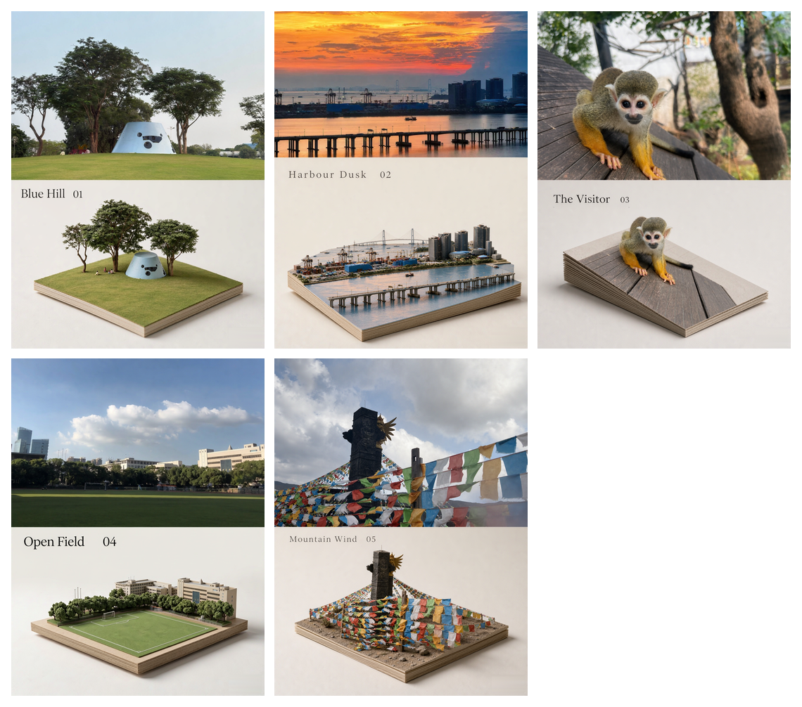
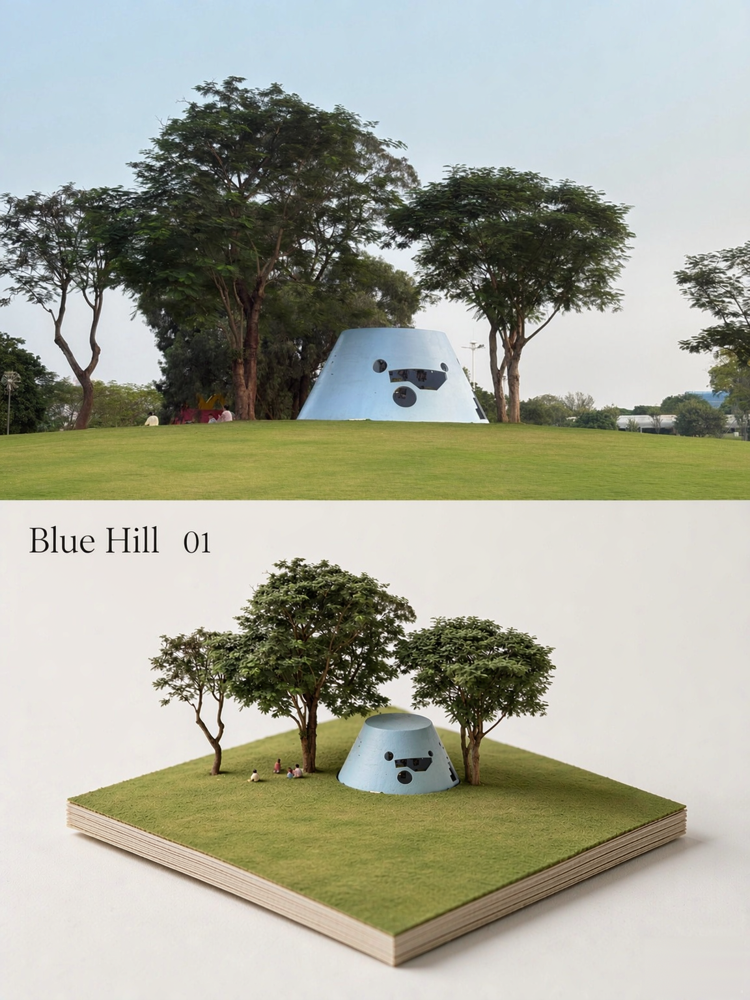
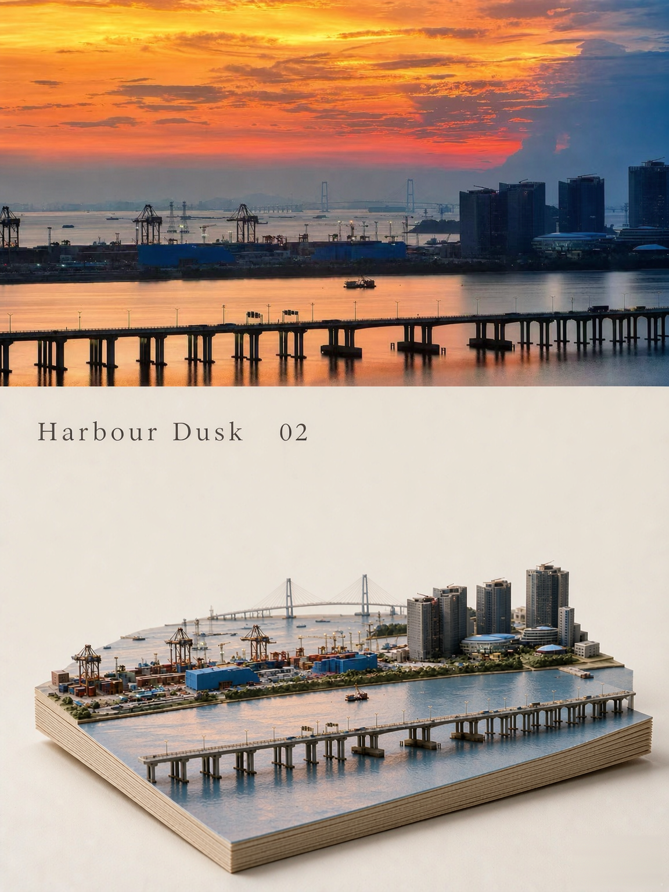
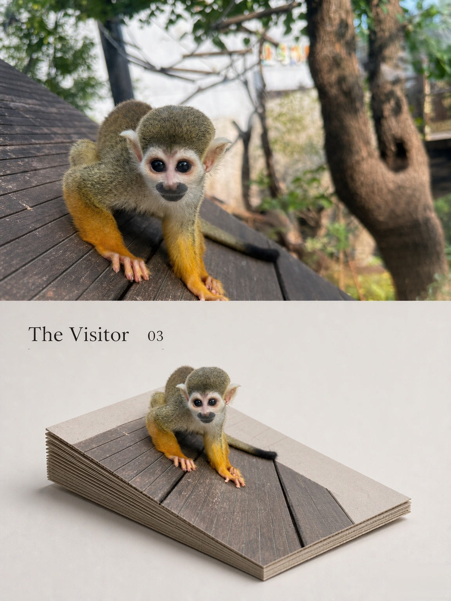
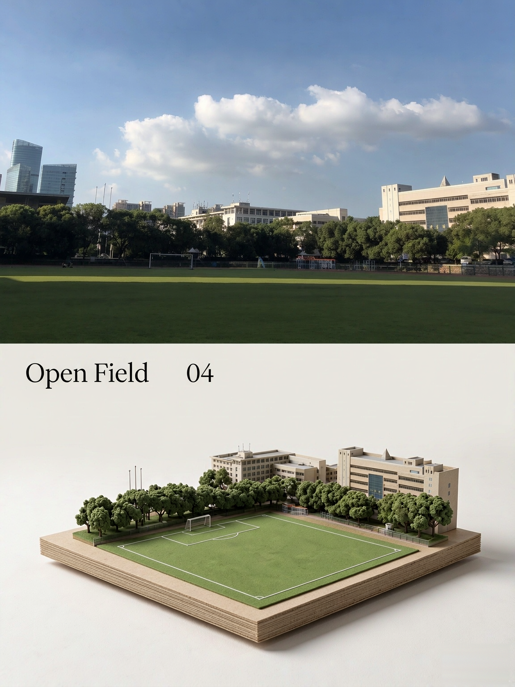
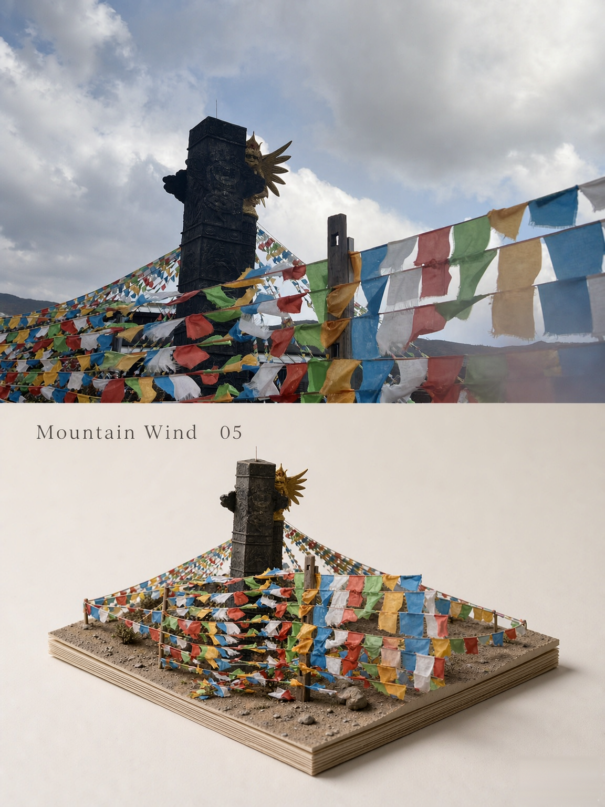

# photo-diorama-poster · 照片 → 等距微缩模型海报

> 把一张照片做成「上下 1:1 分区」的高级编辑风海报——**上半区是原照片**（仅做杂志级调色），**下半区是同一主体的微缩实体模型（diorama）**：原图那块地形被整片切下，安放在一块很薄的层叠纸板上，哑光材质、近白影棚背景、柔和接触阴影。配色完全取自原图，并配一个克制的英文标题与微型注释。



**不用任何 API Key，也不绑定任何图像工具。** 核心只是一份**槽位化母版提示词 + 从照片提炼槽位的方法**，所以任何具备文生图 / 图生图能力的智能体都能直接用：

**WorkBuddy · 豆包 · Codex · ChatGPT(GPT) · Claude · Gemini · Kimi · 通义 · 元宝** ……

---

## 效果示例

上面那张总览是 5 张成品的拼图。下面是原尺寸单张（每张都是**上半区原照片 + 下半区微缩模型**的完整海报）：

### Blue Hill 01


### Harbour Dusk 02


### The Visitor 03


### Open Field 04


### Mountain Wind 05


## 为什么是「diorama」而不是「插画」

下半区**不是扁平矢量插画，也不是照片的复制**，而是一个摆在白背景上的实体沙盘。这个心智图像一旦错了，后面全错：

- ✅ 薄层叠纸板基座（侧面露出一层层纸页纹理）
- ✅ 板顶面沿用原图那块地形
- ✅ 哑光材质、近白影棚背景、板下只有一层收敛的接触阴影
- ❌ 不得是扁平矢量插画、不得是照片复制、不得出现竖立天空面板

---

## 支持的平台与安装方式

| 平台 | 怎么用 | 是否需要脚本 |
|---|---|---|
| **WorkBuddy** | 把 `photo-diorama-poster/` 整个目录放进 `~/.workbuddy/skills/` | 建议用（自动抹水印） |
| **豆包 / 元宝 / Kimi / 通义** | 新建智能体 → 把 `SKILL.md` **正文**粘进「人设与回复逻辑」，或直接在对话里粘贴提示词 | 不需要 |
| **Codex** | `git clone` 后用 `build_prompt.py` 装配、调图像 API 出图、再跑修补脚本 | 可全自动 |
| **ChatGPT / GPT** | 自定义 GPT：把 `SKILL.md` 正文粘进 Instructions；或直接对话中粘贴提示词 + 上传照片 | 不需要 |
| **Claude** | 把 `SKILL.md` 作为系统提示，配合图像生成 MCP / 外部 API | 视配置 |
| **Gemini** | 直接粘贴提示词，用其图像生成能力 | 不需要 |

> **通用做法（最简单的那个）：** 打开 `references/prompt-zh.txt`（中文）或 `prompt-en.txt`（英文），把里面的 `{{...}}` 槽位替换成你这张照片的内容，然后把**整段提示词 + 原照片**交给任意图像模型（图生图 / 参考图，保真度调高）。就这一步，没有别的依赖。

---

## 三步走（任意平台通用）

### 1. 装配提示词

```bash
python3 scripts/build_prompt.py \
  --title "Still Waters" \
  --subject "一位老渔民站在木质小船上，面朝左侧" \
  --palette "深靛蓝 / 雾灰蓝 / 暖沙白" \
  --notes "03"
```

脚本只依赖 **Python 标准库**，读取 `references/prompt-zh.txt` 把成品提示词打到标准输出。常用参数：

| 参数 | 作用 |
|---|---|
| `--variant vertical\|square\|landscape\|wide` | 画幅，默认 `vertical`（3:4 竖版） |
| `--layout topbottom\|leftright` | 分区轴，默认上下；横构图照片建议 `leftright` |
| `--lang zh\|en\|both` | 用哪版母版，默认中文 |
| `--part lower` | 只出下区模型提示词（合成路线用） |
| `--notes -` | 不输出注释编号 |
| `--uppercase` | 标题转全大写 |

不方便跑脚本？直接手改 `references/*.txt` 里的槽位也一样。

### 2. 生成

把整份提示词**连同原图**交给图生图（保真度 high）。下区的板顶面要沿用原照片那块地形，**只有把原图交给模型才做得到**。

> 下区会不会退化成照片，不取决于保真度，而取决于母版里四条机制是否都在：**近白影棚背景 + 很薄的层叠纸板基座 + 哑光材质 + 禁止景深/虚化/噪点**。母版已经写死，别删。

### 3. 后处理（可选，仅当需要局部修补时）

生成图常有两类小瑕疵：右下角平台水印、标题下偶发装饰横线。skill 自带两个脚本做**局部修补**（不重跑、不花额度）：

```bash
npm install sharp                                  # 首次
NODE_PATH=<sharp 所在 node_modules> node scripts/patch_watermark.js --in 生成图.png --out 成品.png
NODE_PATH=<sharp 所在 node_modules> node scripts/patch_rule.js --in 成品.png --detect   # 先看是否命中
NODE_PATH=<sharp 所在 node_modules> node scripts/patch_rule.js --in 成品.png --out 成品.png
```

> 这两个脚本是给「能跑 Node 的平台」（WorkBuddy / Codex / 本地环境）用的加分项。豆包、ChatGPT 等**纯对话平台不需要也无法运行**——那就在提示词里加一句「不要水印、标题下不要下划线或分隔线」来规避即可。

---

## 各平台详细步骤

### WorkBuddy（原生 Skill，最省事）

```bash
git clone https://github.com/szyhululu/photo-diorama-poster.git
cp -r photo-diorama-poster ~/.workbuddy/skills/
```

之后直接说「把这张照片做成上下分区的等距微缩海报」即可触发。生成后脚本会自动抹掉 ImageGen 的右下角水印。

### 豆包 / 元宝 / Kimi / 通义（对话型平台）

1. 新建一个**智能体**（豆包在「我的 → 智能体 → 创建智能体」）
2. 把 `SKILL.md` 的**正文**（去掉开头 `---` 之间的 frontmatter 也行）整段粘进「人设与回复逻辑 / Instructions」
3. 上传你的照片，说「按上面的规范，把这张照片生成上下分区海报」
4. 若平台图像生成需要点一次授权，点确认即可

> 这些平台的图像生成通常支持「参考图 / 图生图」，上传原照片是关键。

### Codex（可全自动）

```bash
git clone https://github.com/szyhululu/photo-diorama-poster.git && cd photo-diorama-poster
python3 scripts/build_prompt.py --title "..." --subject "..." --palette "..." --notes "01" > prompt.txt
# 用 prompt.txt + 原图 调用你的图像 API（如 OpenAI Images / gpt-image-1 的图生图），得到 poster.png
npm install sharp
NODE_PATH=./node_modules node scripts/patch_watermark.js --in poster.png --out final.png
```

把上面整套交给 Codex，它能自己串起来跑。

### ChatGPT / GPT

- **临时用**：新开对话 → 上传照片 → 粘贴 `references/prompt-zh.txt` 填好的提示词 → 让它按图生成。
- **常用**：建一个自定义 GPT，把 `SKILL.md` 正文粘进 Instructions，之后每次只需传图。

### Claude

Claude 本身不产图。把它当作**编排者**：用 `SKILL.md` 作系统提示，接入一个图像生成 MCP 或外部 API（如 OpenAI / 混元 / SDXL）来出图，再让它跑修补脚本。

### Gemini

直接粘贴提示词，用 Google 的图像生成能力（建议用英文母版 `prompt-en.txt`）。

---

## 目录结构

```
photo-diorama-poster/
├── SKILL.md                       # 工作流与硬性约束（也是给其它智能体的系统提示）
├── references/
│   ├── prompt-zh.txt              # 中文母版（槽位化，可改）
│   ├── prompt-en.txt              # 英文母版（部分模型英文更稳）
│   └── guide.md                   # 槽位提炼 / 变体 / 排错 / 自检清单
├── scripts/
│   ├── build_prompt.py            # 提示词装配（Python 标准库）
│   ├── compose_halves.js          # 路线 B 本地合成（Node + sharp）
│   ├── patch_watermark.js         # 抹平台水印
│   └── patch_rule.js              # 抹标题下偶发装饰横线
├── examples/                      # 5 张成品示例 + 拼图
├── README.md
└── LICENSE
```

## 依赖

- `build_prompt.py`：Python 3，仅标准库
- `*.js`：Node.js + [`sharp`](https://github.com/lovell/sharp)（仅后处理/合成需要）
  ```bash
  npm install sharp
  ```

## License

[MIT](LICENSE) © Song Ziyue (宋子月)
